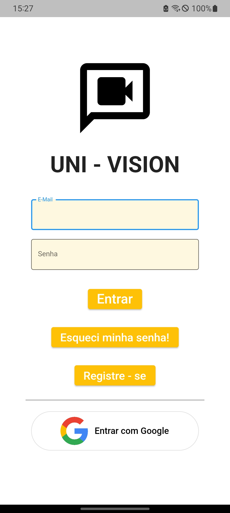
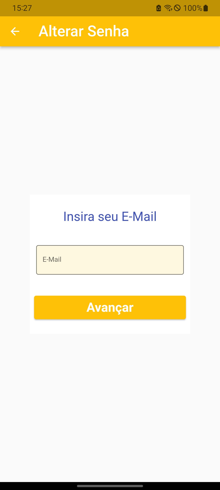
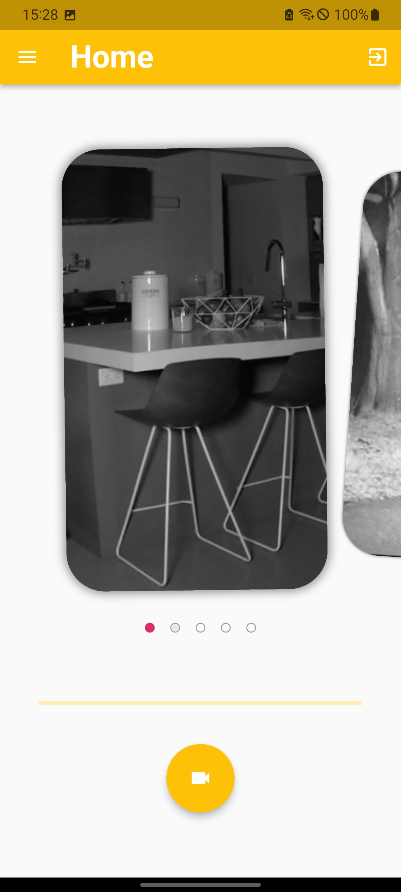
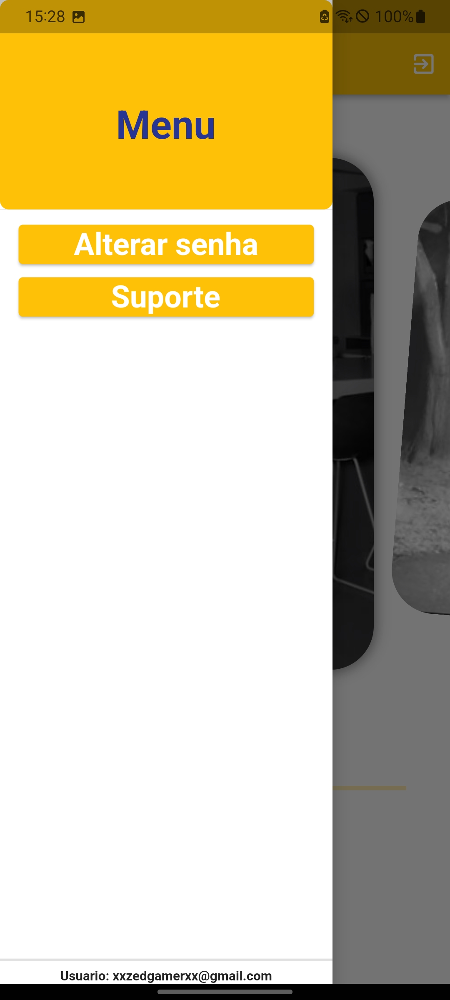

# Uni Vision!

## O que é?
Uni vision é um produto da empresa Uni Monitorig, no qual o intuito
é gravar e monitorar cameras de segurança a partir do seu celular
ou navegador web através do desktop.

## Prints

### Paginas de Resgistro e Login

  
  
  

### Ambiente Principal do App

  
  
  

  
